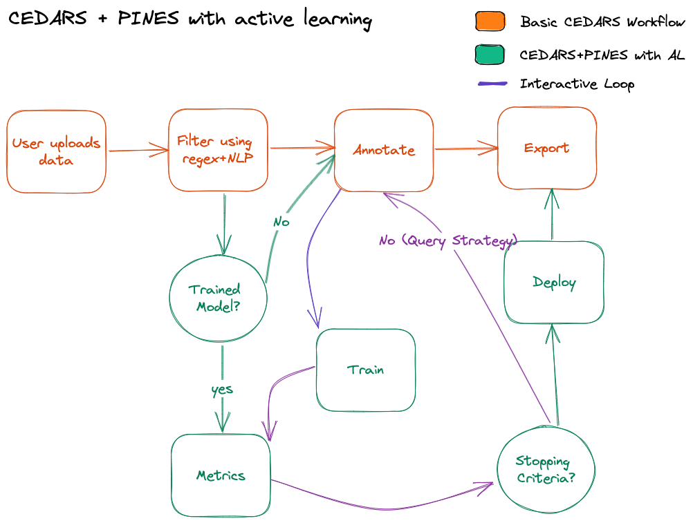

# PINES-AL (Active Learning)

*Authors*: Rohan Singh, Simon Mantha

*Product*: pines.ai

*Stakeholder*: Simon Mantha (manthas@mskcc.org)

## Overview
PINES (Periodic Inference and Nested Episodic Service) is an active-learning framework through for text classification.  It can help investigators and researchers to quickly annotate textual data^^^ using for analysis.

### What is active learning?

Active learning is a special case of machine learning in which a learning algorithm can interactively query a user (or some other information source) to label new data points with desired outputs (wikipedia)

## Scenarios

1. **No labeled data**: Dr Smith wants to find all patients who have a fracture in the pelvic region. However, there are no standardized data that he can use to find such patients. The only way he can get the data is by reviewing all patients notes which meet a certain criteria. Review patient notes can be a time consuming process and Dr. Smith is very busy. He can relatively quickly annotate all this patients using PINES. He will upload^ all his patient notes to the PINES platform. PINES will randomly^^ show him 50 notes which Dr. Smith will have to label manually. Once 50 annotations are done, the model will start training on the 50 examples and make predictions for all data. The model will then present the most relevant** examples to Dr. Smith for more manual annotations. After each train cycle, Dr. Smith will be presented with model metrics^^^. Dr. Smith will stop annotating once his desired metrics are achieved or other **Stopping Criteria** is reached.
2. **Trained model available but different population**: MSK already has a model which was trained to find *deep venous thrombosis* (DVT) events. Dr Parker at Dana Farber wants to find all patients with DVT in his patient cohort. MSK provides her with the pre-trained model. Dr. Parker fires up the PINES application and selected the MSK model as the starting model. In this case, she doesn't need to label any data to start with. The model will run an initial pass and present her with the metrics. If the metrics are as per her requirements, she can use the model without any annotations. If not, the model will present her the most relevant** examples to annotate and the re-training cycle will start (same as Scenario 1)

## Flowchart

### PINES (Active Learning)

### CEDARS + PINES

### PINES-AL Workflow

1. Live server during training with GPU
	1. Start server
		1. CLI
		2. GUI Based
			1. Dropdown to select Model
			2. Num Iterations (Budget)
			3. Samples per iteration
			4. Initialization Strategies
			5. Query Strategies
	2. Server talks to the same Mongo instance as CEDARS
2. Final Model saved
3. All data is labeled using saved model from 2.
4. Use CEDARS export 

### Footnotes

^^^ Future work to add other modalities
  
^ The data will not leave his network without being encrypted

^^ Several **Initialization Strategies** can be used depending on the availability for labelled data

** Several **Query Strategies** can be used for find the most relevant or useful examples for labeling
