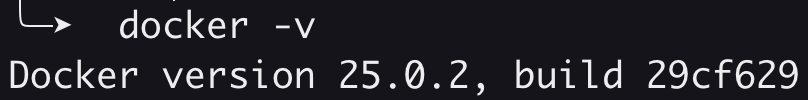
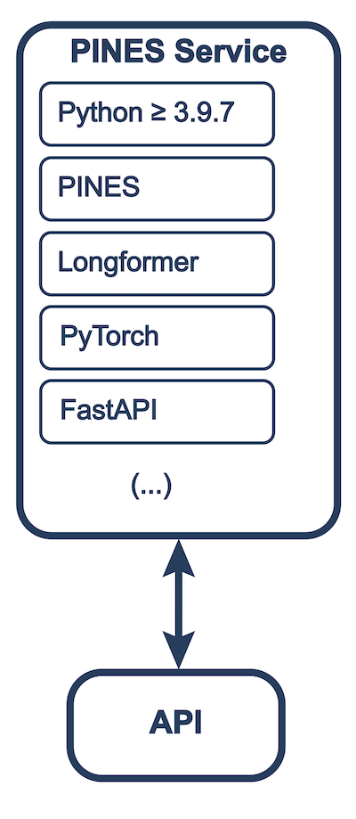

# PINES User Manual

> **PINES is provided as-is with no guarantee whatsoever and users agree to be held responsible for compliance with their local government/institutional regulations.** All PINES installations should be reviewed with institutional information security authorities.

PINES provides a simple inference API to interact with large language models to detect clinical events in free text. The software is designed to be used in a clinical research setting, where the user has access to a large dataset of clinical notes and wants to detect the presence of a specific event.


## Software Installation

The software can be installed `locally` or run can be run as a `Docker` container. 

### Detailed Requirements

#### Local Installation
- Python 3.9 or later
- poetry

    To install poetry, run `pipx install poetry` or follow the [instructions](https://python-poetry.org/docs/).

Once poetry is installed, you can install the package locally by running the following commands:
```bash
git clone https://github.com/CEDARS-NLP/PINES.git
cd PINES
poetry install # this will install all required packages
poetry run python pines.py # this will run the package
```

#### Docker Installation
- Docker

    Verify `docker -v` works on your system.

    

    If it does not, please follow the [Docker installation instructions](https://docs.docker.com/get-docker/).

Once Docker is installed, you can install the package as a Docker container by running the following commands:
```bash
git clone https://github.com/CEDARS-NLP/PINES.git
docker build -t pines-api .
docker run -dp 127.0.0.1:8036:8036 pines-api
```

### System Architecture



### Standalone PINES Installation

Standalone PINES installation is a preferred method for users who want to apply the software on their notes without the need to deploy a full CEDARS stack.

### Installing PINES in CEDARS Docker Deployment

PINES is available as a Docker container and can be deployed as part of the CEDARS stack. This is the preferred method for users who want to use PINES as part of the CEDARS stack.

## Operation

In all deployment methods, PINES is available as a service on port 8036. The service can be accessed using a RESTful API. The API is documented in the [API Reference](API_reference.md).

## Function Reference

### :::pines.detect
---
### :::pines.detect_batch
