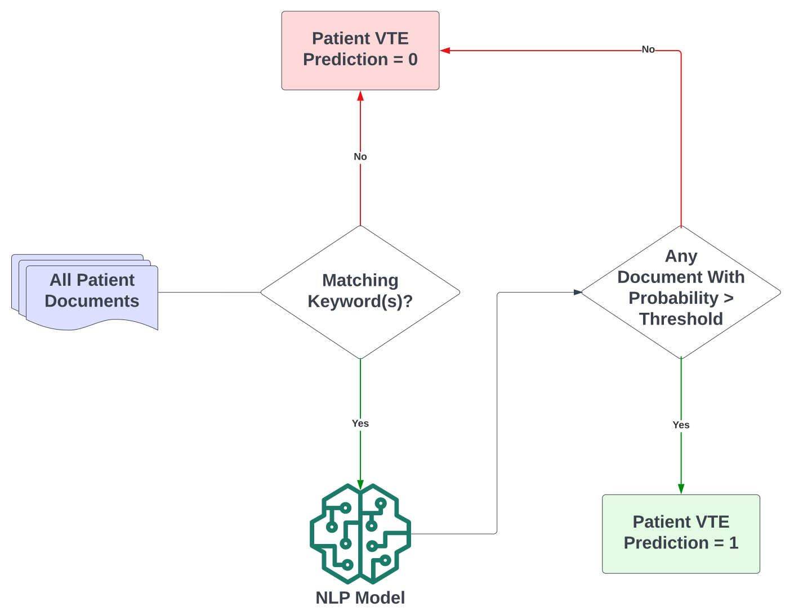
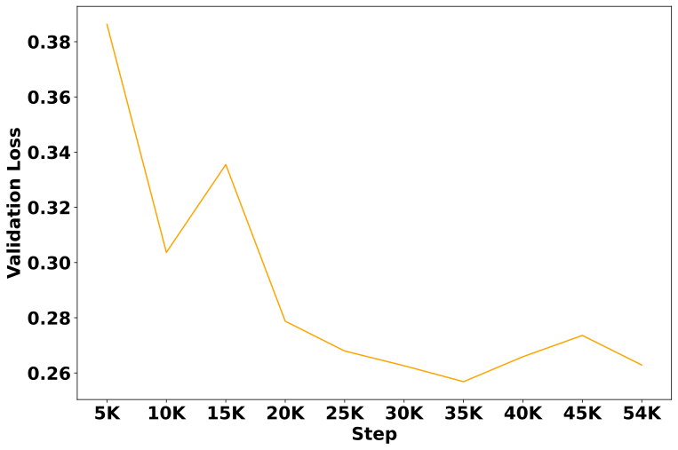
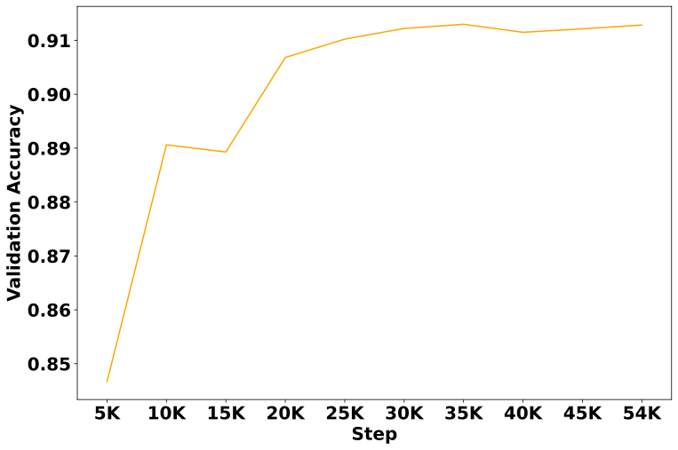
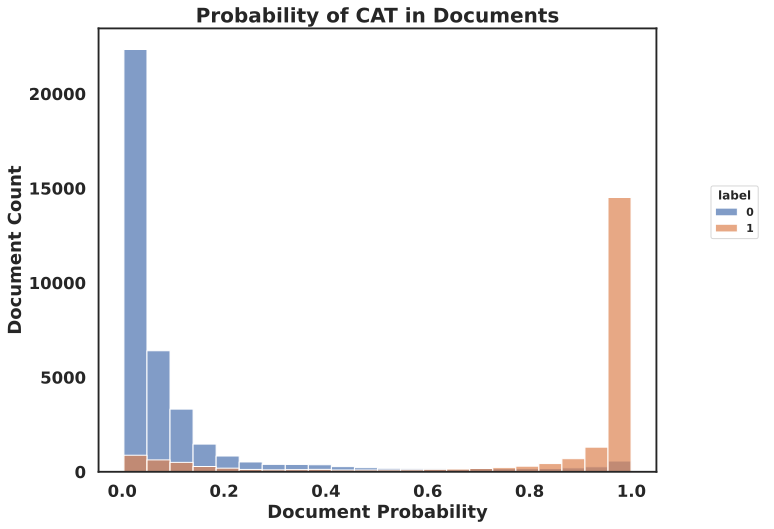
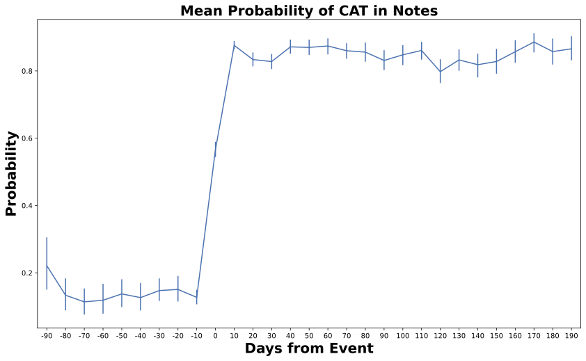
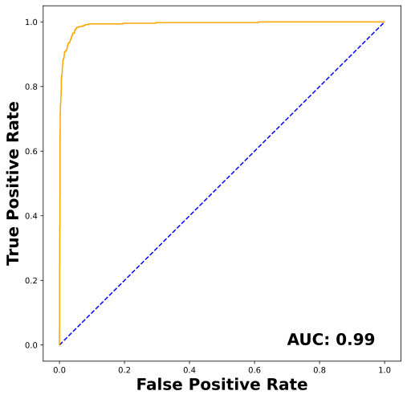
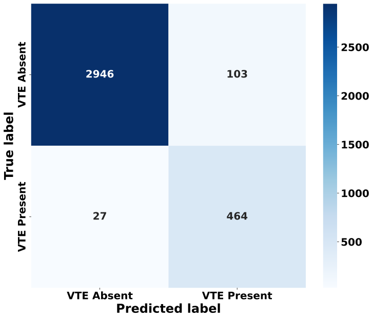

---
# Feel free to add content and custom Front Matter to this file.
# To modify the layout, see https://jekyllrb.com/docs/themes/#overriding-theme-defaults

layout: home
title: PINES
summary: Progressive Inference Nested Episodic Service
---

# Introduction

The PINES package detects if a patient note came before or after the occurence of an event such as Deep Venous Thromboembolism. It uses Large Language Models (LLMs) to  detect the events in clinical text and provide predicted probabilities.

*Fig 1. Labeling Patient Notes*

# Datasets

| Set         | Patients    | Notes   |
| ----------- | ----------- | ------- |
| Training    | 24,774      | 394,948 |
| Validation  | 3,540      | 55,502 |
| Dev         | 3,540      | 60,134 |
| Test | 3, 540 | - | 

# Training

A _Longformer-4096_ LLM model was fine-tuned on the training dataset of 394,948 notes. Sliding window attention of 512 (256 on each side) was used along with global attention on _Venous Thromoboemolism_ related keywords. The selected model had the best loss on the validation
set. 

 
*Fig 2. Validation Loss*

*Fig 3. Validation Accuracy*

# Results

The _fine_tuned_ model was used to predict the probability of the unseen notes in the DEV set.

*Fig 4. Predicted probabilities of notes with true labels*

With the predicted probabilities of notes per patient, the _date_ of Venous Thromboembolism was predicted using Maximum Likelihood.

*Fig 5. Difference between estimated and predicted dates*

At a patient level, the following metrics were obseved with cutoff probability of **0.955**

| Metrics         | Value    | 
| ----------- | ----------- | 
| Accuracy   | 0.96 (0.96 - 0.97)      | 
| Precision  | 0.82 (0.79 - 0.85)      | 
| Recall     | 0.95 (0.92 - 0.96)      |
| Specificity | 0.97 (0.96 - 0.97)|

{: width="500" }

*Fig 6. ROC for predicting patients with VTE*

{: width="500" }

*Fig 7. Confusion Matrix for predicting patients with VTE*

